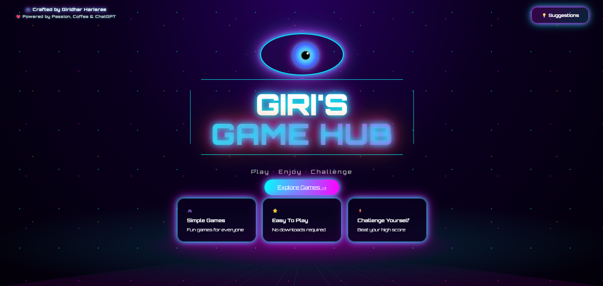
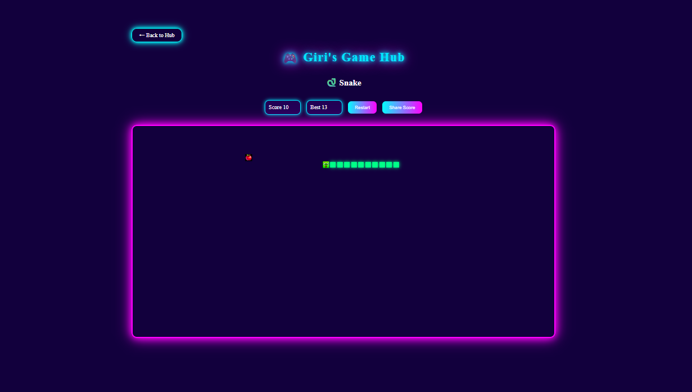
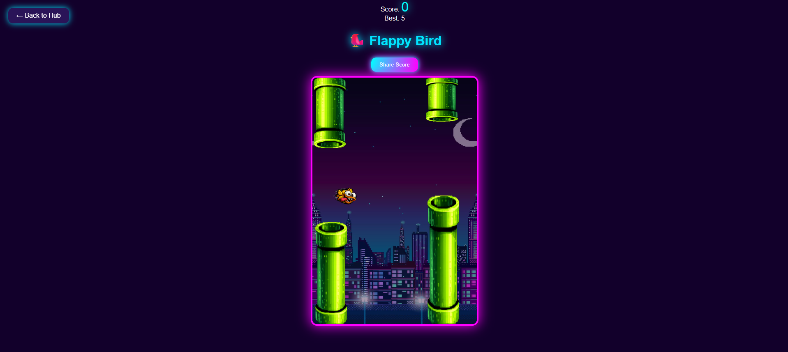
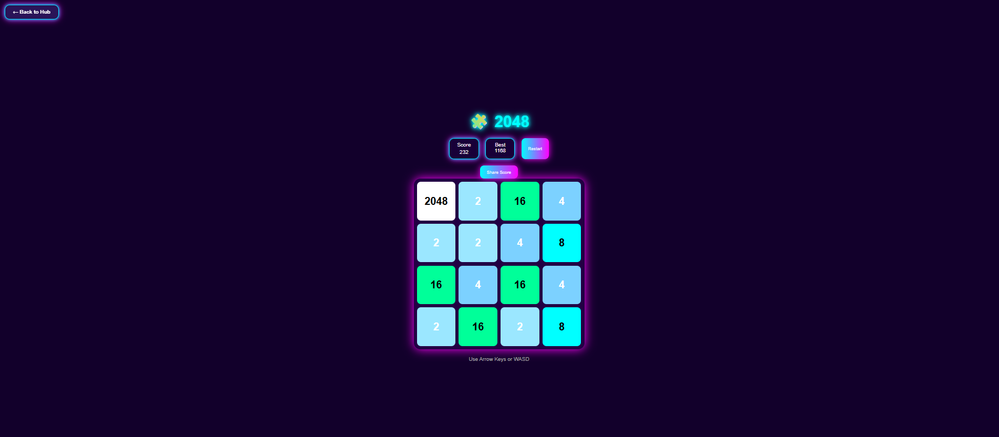
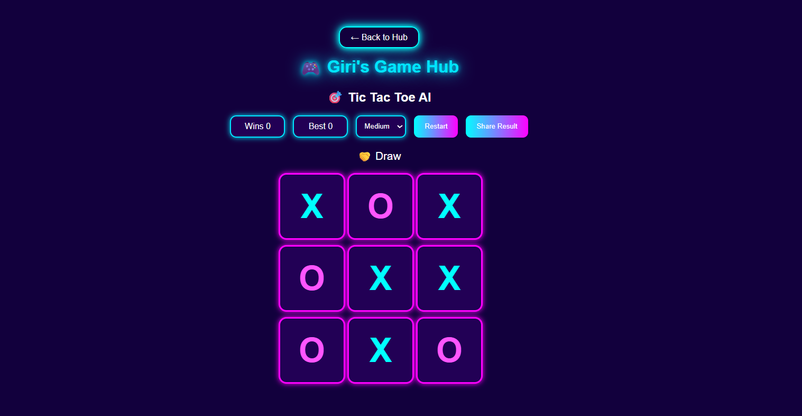
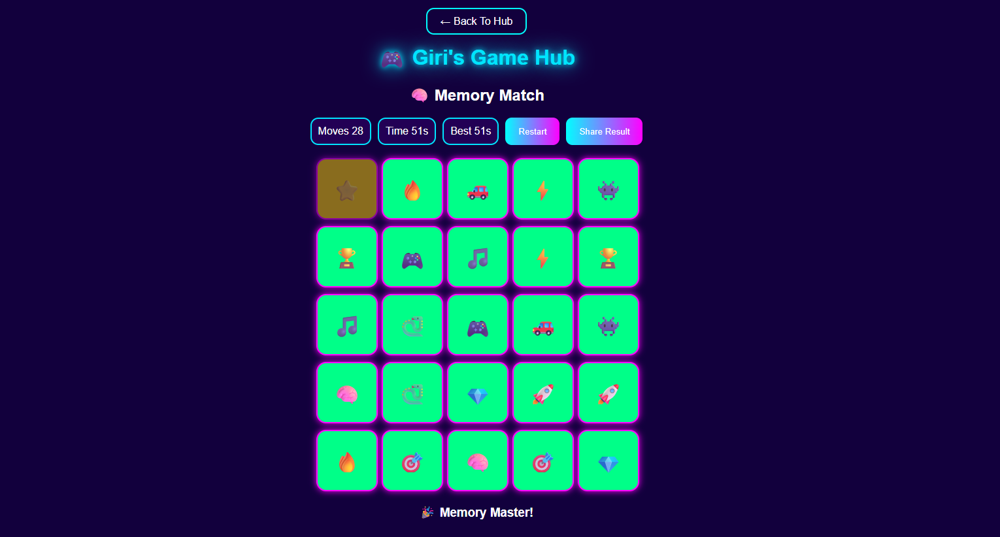

# 🎮 Giri's Game Hub
### Version 1.0 🚀

### 🚀 A Neon-Powered Browser Gaming Hub

Play classic arcade games directly in your browser with score tracking, AI opponents, and social sharing.

🌐 **Live Demo:** https://girighub.netlify.app/

❤️ Crafted by **Giridhar Harisree**
🤖 Powered by passion, coffee & ChatGPT

---

## ✨ Features

* 🎨 Custom Neon Gaming UI
* 📱 Mobile Friendly Design
* 🏆 Best Score Tracking
* 📤 Share Results with Friends
* 💾 Local Storage Support
* 🎵 Sound Effects
* ⚡ Fast & Lightweight

---

# 🎮 Games Available

| Game              | Features                        |
| ----------------- | ------------------------------- |
| 🐍 Snake          | High Score, Share Result        |
| 🐦 Flappy Bird    | Best Score, Share Screenshot    |
| 🧩 2048           | Win Detection, Score Tracking   |
| 🎯 Tic Tac Toe AI | Easy / Medium / Hard AI         |
| 🧠 Memory Match   | Golden Card Power-up, Best Time |

---

# 📸 Screenshots

## 🏠 Home Page

## 🐍 Snake

## 🐦 Flappy Bird

## 🧩 2048

---

## 🎯 Tic Tac Toe AI

---

## 🧠 Memory Match

---

# 🛠️ Built With

* HTML5
* CSS3
* JavaScript (Vanilla JS)
* Local Storage API
* Web Share API
* Netlify

---

## 🚀 Current Release

### V1.0 Features

- ✅ Snake
- ✅ Flappy Bird
- ✅ 2048
- ✅ Tic Tac Toe AI
- ✅ Memory Match
- ✅ Best Score Tracking
- ✅ Share Score Cards
- ✅ Mobile Support

### Planned for V2.0

- 🔄 Mallu Meme Run
- 🔄 Racing Game
- 🔄 Sudoku
- 🔄 Achievements System
- 🔄 Global Leaderboard
---

# 🎯 Why This Project?

This project was built to explore game development concepts using pure HTML, CSS, and JavaScript while creating a fun and responsive gaming experience that works across desktop and mobile devices.

---

## 🌟 Support

If you enjoyed the project:

⭐ Star this repository
🎮 Play the games
💡 Share suggestions and feedback

---

### 🎮 Giri's Game Hub

Made with ❤️ by Giridhar Harisree

